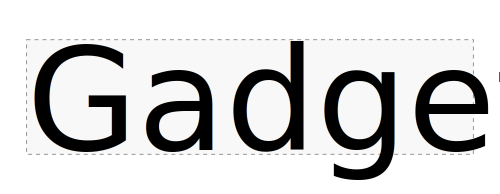

<p align="center">

</p>

`gadget` is a Python library for model creation using the GGML compute framework. It provides Python bindings for most low-level GGML functions, a Python interface for reading/writing GGUF files, and a high-level interface for creating and executing models.

Here's a minimal example of how to use `gadget` to create a model and run inference on the CPU:

```python
import numpy as np
from gadget import GgmlModel, Tensor
from gadget.ggml import ggml_mul_mat

# simple model interface
class LinearModel(GgmlModel):
    weight: Tensor('F32', ('input_dim', 'output_dim'))
    inputs: Tensor('F32', ('input_dim', 'batch_size'))

    def forward(self):
        ctx = self.ctx_graph
        w, x = self.tensors['weight', 'inputs']
        return ggml_mul_mat(ctx, w, x)

# generate random weights and input data (note reverse order of dimensions)
input_dim, output_dim, batch_size = 256, 32, 16
weight_np = np.random.randn(output_dim, input_dim).astype(np.float32)
inputs_np = np.random.randn(batch_size, input_dim).astype(np.float32)

# create model and execute
model = LinearModel.from_values(
    dict(weight=weight_np), input_dim=input_dim,
    output_dim=output_dim, batch_size=batch_size
)
output_np = model(inputs=inputs_np)
```

To run on the GPU, you can pass `backend='cuda'` to the `GgmlModel` constructor and pass the weights and data as `torch` tensors on the GPU. In practice, you'll likely be loading the weights for these models from GGUF files, in which case you can use the `from_gguf` and `from_path` constructors for `GgmlModel`.

For more examples, see the `test_*` functions in `model.py` and `compute.py`, or the full fledged implementations in `gadget/models`. One can implement fairly complex models with a relatively small amount of code. Though adding in Python as a dependency is a deal-breaker for some projects, some advantages of `gadget` are:
- tokenization is hell, let Huggingface handle it!
- can do rapid prototyping and experimentation without having to compile anything
- no need for round-trips to and from the GPU (could be important for embeddings?)
- easier to rapidly integrate things like novel sampling methods

**BONUS**: We now have `entropix` integration! If you check out `gadget/shrek.py`, you'll find `ShrekGen` and `ShrekChat` analogs of `TextGen` and `TextChat` that use the sampling method from [entropix](https://github.com/xjdr-alt/entropix) (aka "Shrek sampler"). Note that you'll need to install `entropix` separately, as it is not a strict dependency of `gadget`.

# Install

To install with `pip` run:

```bash
pip install gadget-ml
```

You can pass arguments to `cmake` using the `CMAKE_ARGS` environment variable. For example, to add CUDA support:

```bash
CMAKE_ARGS="-DGGML_CUDA=ON"
```

You can install locally after cloning this repository with:

```bash
pip install -e .
```

To build the shared libraries for local testing, you can use `cmake` directly

```bash
cmake -B build .
cmake --build build -j
```

# Usage

`gadget` comes with built-in support for popular models, such as Llama for text generation and BERT for embeddings, which actually covers a lot of cases. To do a simple completion with Llama, you can run something like

```python
from gadget import TextGen
model = TextGen(path_to_gguf, huggingface_model_id)
reply = model.generate(prompt)
```

For a conversation interface, you can use the `TextChat` class with

```python
from gadget import TextChat
model = TextChat(path_to_gguf, huggingface_model_id, system=system_prompt)
reply = model.generate_chat(prompt)
```

To do streaming generation, use the respective `stream` and `stream_chat` methods. You can control the maximum length of the generated text with the `max_gen` argument. As for BERT embeddings, you can run the following on a string or a list of strings `texts`:

```python
from gadget import EmbedTorch
model = EmbedTorch(path_to_gguf, huggingface_model_id)
vecs = model.embed(texts)
```

In all of the above, `path_to_gguf` is the path to the GGUF file and `huggingface_model_id` is the full name of the model on Huggingface. The default backend is `cpu`. To run on the GPU, use `backend='cuda'`. Metal is currently not supported, as I don't have anything to test it on.

# Internals

## `GgmlCompute`

The lowest level interface is the `GgmlCompute` class, which takes care of creating, setting, and getting tensors, as well as graph creation and execution. The constructor takes three arguments:
- `params`: a dictionary of parameter names and values (`name: value`)
- `tensors`: a dictionary of tensors specifications (`name: (dtype, shape)`)
- `model`: a function that takes fields and tensors as inputs and returns an output tensor
- `backend = 'cpu'`: the backend to use for computation (`cpu` or `cuda`)
- `framework = 'numpy'`: the default framework for array output (`numpy` or `torch`)

The `model` function should have the signature `model(context, params, tensors)` and return an output tensor. There are some simple usage examples at the end of `compute.py`. It has the following methods:

- `create_graph(model)` — creates the computational graph for a model function
- `destroy_graph()` — deallocates the computational graph
- `get_input(name)` — retrieves input tensor value by name
- `set_input(name, array, offset=None)` — sets input tensor value by name
- `get_named_node(name)` — retrieves tensor values for a graph node by name
- `compute()` — executes the computational graph
- `__call__(**values)` — sets input values, computes, and returns the output

## `GgmlModel`

In most cases, however, you'll want to use the higher level `GgmlModel` interface. This takes a cue from the JAX library `equinox` and uses class-level type hints to dictate which tensors should be created. Additionally, it takes a GGUF file (via `GgufFile`) as input and loads tensors from that. There are three types of metadata that can be included:

- `Parameter`: values that can be set on object creation like `batch_size`
- `Tensor`: tensors (input or working) that can be provided by the user
- `State`: runtime variables whose mutation will trigger a graph recompile (like `n_tokens`)

This handles loading directly from GGUF objects or paths, and will automatically recompile the compute graph whenever `self.state` is modified. To use this class, subclass it with the appropriate type hints and implement the `forward` method. You can then initialize the model using the `from_values` or `from_gguf`/`from_path` methods. It also has the following methods:

- `rebuild_graph()` — rebuilds the graph
- `__call__(**kwargs)` — rebuilds the graph (if `self.state` has changed) and calls `GgmlCompute.__call__`

## `LlamaModel`

The class `LlamaModel` does single sequence logit computation with KV caching. The `context_length` parameter controls the size of the KV cache, and the `batch_size` parameter controls the maximum number of tokens that can be passed to the model in a single call. It has the following additional methods:

- `reset()` — resets the model state (sets `n_past = 0`)
- `__call__(tokens)` — sets the input tokens and calls `GgmlCompute.__call__`

## `BertModel`

The class `BertModel` implements BERT embeddings, which covers a very wide variety of embedding models today. Currently, pooling is done outside of `ggml` in `numpy` or `torch`, but you could imagine subclassing `BertModel` and wrapping the `forward` function to perform pooling inside the model. It has the following additional methods:

- `__call__(tokens, positions, mask, n_tokens=None)` — sets the input tokens, positions, and mask, and calls `GgmlCompute.__call__`

## `TextGen`

The class `TextGen` handles text generation and streaming. The constructor accepts the following arguments:

- `gguf_or_path`: path to a GGUF file or Huggingface model ID
- `model_id`: Huggingface model ID (for tokenizer only)
- `model_class = LlamaModel`: class of model to use for generation

It has the following additional methods:

- `reset()` — resets the model state
- `tokenize(texts, **kwargs)` — tokenizes a list of texts
- `detokenize(tokens)` — detokenizes a list of tokens
- `logits(tokens)` — computes the logits for a sequence of tokens
- `sample(tokens, temperature=0.7, top_p=0.9, top_k=50)` — samples a single token from the model
- `stream_tokens(tokens, max_gen=128)` — streams tokens from the model
- `stream(text, max_gen=128)` — streams text from the model
- `generate(text, max_gen=128)` — generates text from the model

## `TextChat`

The class `TextChat` is a subclass of `TextGen` that adds a system prompt and handles chat history. It has the following additional methods:

- `stream_chat(text, max_gen=128, prefill=None)` — streams text from the model
- `generate_chat(text, max_gen=128, prefill=None)` — generates text from the model

# Conventions

*Matrix shape and order*: tensors are row-major, meaning elements in a row are stored in contiguous order. However, the way in which dimensions are reported is reversed from `numpy`. The first number in the shape is the number of columns, the second is the number of rows, and so on. The logic here is that the first number denotes the number of elements in a row, the second denotes the number of columns and so on. This makes computing strides for element access much easier.

Tensor shapes are reported using the `ggml` convention. But you still have to keep this in mind that when setting tensor values with `set_input`, you need to use the reverse order from what `ggml` reports. So something that is shape `(k, n, m)` in `ggml` should be shape `(m, n, k)` in `numpy`.

*Matrix multiplication*: for `ggml_mul_mat` and others, the *GGML*-style shape of inputs `a` and `b` and output `c` should be
```
a ~ (k, n, i, j)
b ~ (k, m, i, j)
c ~ (n, m, i, j)
```
In other words, the matmul is performed over the first two dimensions according to `c.T = b.T @ a` (or `c = a.T @ b`) and is batched over the remaining dimensions.

If we think about shapes `numpy`-style, then this would read
```
a ~ (n, k, i, j)
b ~ (m, k, i, j)
c ~ (m, n, i, j)
```
And we would write the matrix multiplication as `c = b @ a.T`. So basically the same thing, but everything is transposed to undo the shape reversed notation.
